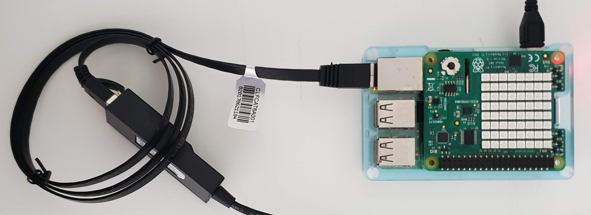

[**Home**](../README.md)

# Connect Raspberry Pi to your Development Machine

<!-- vscode-markdown-toc -->
* 1. [Share Wireless Connection with Ethernet Dongle](#ShareWirelessConnectionwithEthernetDongle)
* 2. [Linux: Configure Shared Network Access](#Linux:ConfigureSharedNetworkAccess)
* 3. [Windows: Configure Internet Connection Sharing](#Windows:ConfigureInternetConnectionSharing)
* 4. [macOS: Configure Internet Sharing](#macOS:ConfigureInternetSharing)

<!-- vscode-markdown-toc-config
	numbering=true
	autoSave=true
	/vscode-markdown-toc-config -->
<!-- /vscode-markdown-toc -->

##  1. <a name='ShareWirelessConnectionwithEthernetDongle'></a>Share Wireless Connection with Ethernet Dongle



The easiest and fastest way to connect a Raspberry Pi to your development machine is to use a USB Ethernet Dongle and and Ethernet Cable between the devices.

You need to share the internet connection from your development machine with the USB Dongle Ethernet connection to the raspberry Pi. 

##  2. <a name='Linux:ConfigureSharedNetworkAccess'></a>Linux: Configure Shared Network Access

```bash
nm-connection-editor
```

1. Select Wired Connection

2. Click settings (or double click on "Wired Connection")

3. Select Method: Shared to other computers
4. Click Save

##  3. <a name='Windows:ConfigureInternetConnectionSharing'></a>Windows: Configure Internet Connection Sharing

##  4. <a name='macOS:ConfigureInternetSharing'></a>macOS: Configure Internet Sharing

[HOW TO SHARE INTERNET CONNECTION ON A MAC](https://www.mactip.net/share-internet-connection-mac/)

***

[**Next Step** - Set up your Raspberry Pi](install-dotnet-core-raspberry-pi.md)

[**Home**](../README.md)