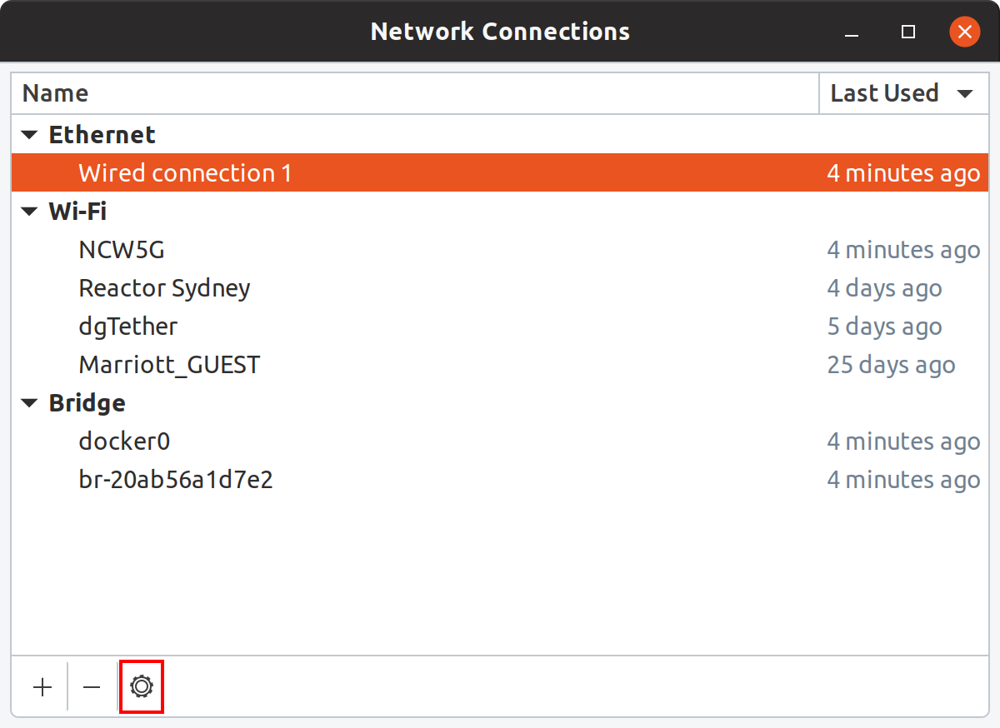

[**Home**](../../README.md)

# Connecting your Raspberry Pi

##  1. <a name='ConnectivityOptions'></a>Connectivity Options

There are two ways you can connect your Raspberry Pi to your development machine. 

1. You can connect to the Raspberry Pi to the same Wifi or Ethernet network as your development machine. This is great for home networks where your Raspberry Pi is the only one on the network.
2. or, using a USB Ethernet dongle connect directly to your development machine and share your desktop internet connection. This provides a fast direct connection to your Raspberry Pi and, it is espically useful in workshop environments as it isolates your Raspberry Pi from others on the network. The downside is you need to buy a USB Ethernet dongle and Ethernet cable.  

##  2. <a name='SharingyourDesktopInternetConnection'></a>Sharing your Desktop Internet Connection


The easiest and fastest way to connect a Raspberry Pi to your development machine is to use a USB Ethernet Dongle and and Ethernet Cable between the devices.

You need to share the internet connection from your development machine with the USB Dongle Ethernet connection to the raspberry Pi. 

##  3. <a name='ConfigureSharedNetworkAccess'></a>Configure Shared Network Access

```bash
nm-connection-editor
```

1. Select Wired Connection

2. Click settings (or double click on "Wired Connection")

3. Select Method: Shared to other computers
4. Click Save

***

[**Next Step**](lab2-install-dotnet-core-raspberry-pi.md)

[**Home**](../../README.md)