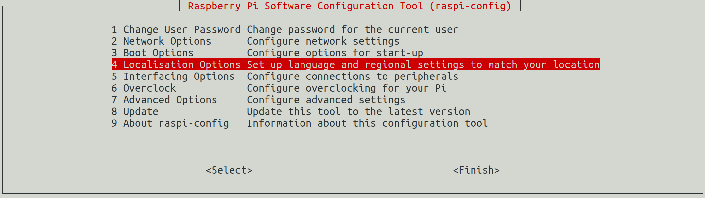
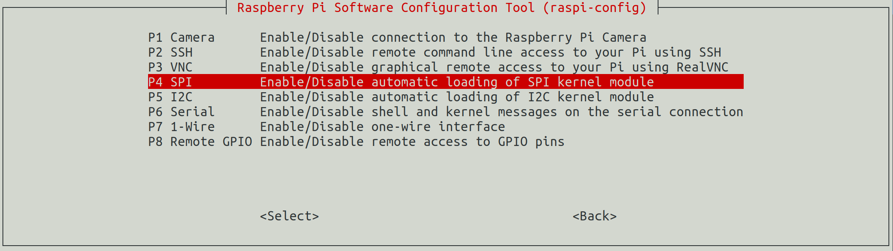
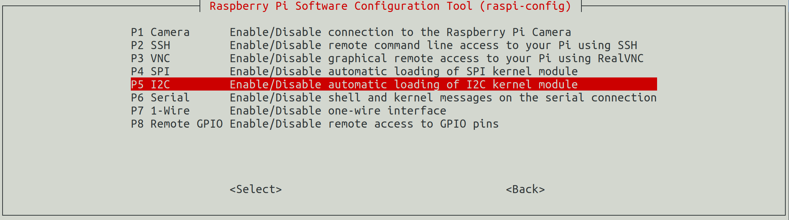
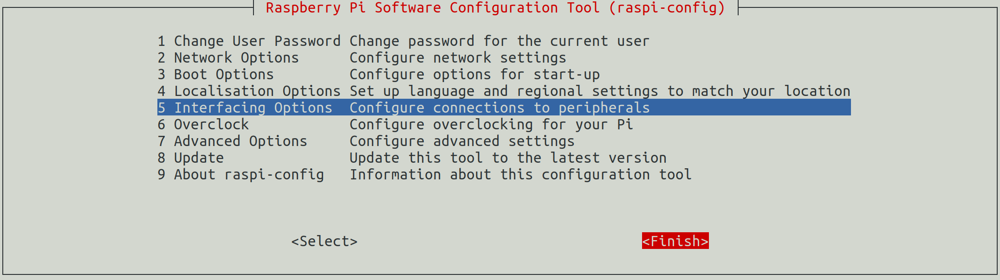

[**Previous Step**](lab1-connect-raspberry-pi.md)

[**Home**](../../README.md)

# Set up your Raspberry Pi

<!-- vscode-markdown-toc -->
* 1. [Start an SSH Connection to the Raspberry Pi](#StartanSSHConnectiontotheRaspberryPi)
* 2. [Update Raspbian Linux](#UpdateRaspbianLinux)
* 3. [Restart the SSH Connection to the Raspberry Pi](#RestarttheSSHConnectiontotheRaspberryPi)
* 4. [Enable I2C and SPI](#EnableI2CandSPI)
* 5. [Install .NET Core Runtime](#Install.NETCoreRuntime)
* 6. [Install Remote Debugging Support](#InstallRemoteDebuggingSupport)
* 7. [References](#References)

<!-- vscode-markdown-toc-config
	numbering=true
	autoSave=true
	/vscode-markdown-toc-config -->
<!-- /vscode-markdown-toc -->

##  1. <a name='StartanSSHConnectiontotheRaspberryPi'></a>Start an SSH Connection to the Raspberry Pi

```bash
ssh pi@raspberry.local
```

##  2. <a name='UpdateRaspbianLinux'></a>Update Raspbian Linux

This will update Raspbian Linux to the latest version and then reboot the Raspberry Pi.

```bash
sudo apt update && sudo apt upgrade -y && sudo reboot
```

##  3. <a name='RestarttheSSHConnectiontotheRaspberryPi'></a>Restart the SSH Connection to the Raspberry Pi

```bash
ssh pi@raspberry.local
```

##  4. <a name='EnableI2CandSPI'></a>Enable I2C and SPI

From the Raspberry Pi command line start the the Raspberry Pi Configurator

```bash
sudo raspi-config
```

1. Localisation Options

2. Select Change Timezone -> Select appropriate timezone -> Back
3. Select Interfacing Options

4. Select SPI -> YES -> OK
5. Select Interfacing Options

6. Select I2C -> YES -> OK
7. Select Finish and reboot


##  5. <a name='Install.NETCoreRuntime'></a>Install .NET Core Runtime

Information on the latest .NET Core Runtime Versions is avalable on the [.NET Downloads](https://dotnet.microsoft.com/download) page and [.NET Core 2.2 downloads.]() page. Look for the .NET Core Binaries and ARM32. The .NET Core Runtime version at the time of writing is 2.2.2. If the version changes then update the export VERSION number.

```bash
export VERSION="2.2" &&
curl  -o dotnet.tar.gz  https://dotnetcli.blob.core.windows.net/dotnet/Runtime/release/$VERSION/dotnet-runtime-latest-linux-arm.tar.gz &&
sudo mkdir -p /usr/share/dotnet && sudo tar -xvf dotnet.tar.gz -C /usr/share/dotnet &&
rm dotnet.tar.gz &&
/usr/share/dotnet/dotnet --info
```

##  6. <a name='InstallRemoteDebuggingSupport'></a>Install Remote Debugging Support

```bash
curl -sSL https://aka.ms/getvsdbgsh | bash /dev/stdin -r linux-arm -v latest -l ~/vsdbg
```

##  7. <a name='References'></a>References

[Remote Debugging On Linux Arm](https://github.com/OmniSharp/omnisharp-vscode/wiki/Remote-Debugging-On-Linux-Arm)

***

[**Next Step**](lab3-install-dotnet-core-desktop.md)

[**Home**](../../README.md)